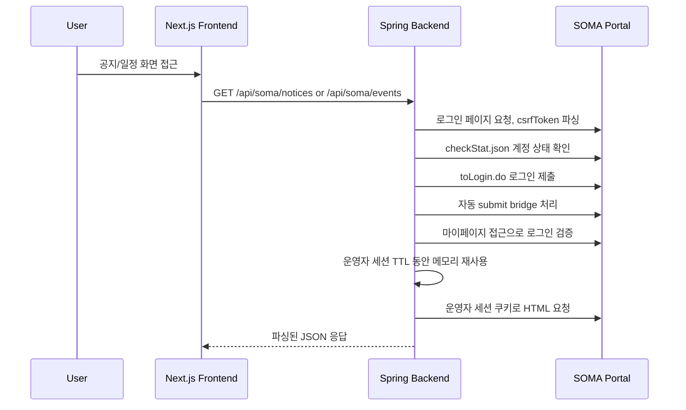

# SOMA Portal Features

이 문서는 현재 구현된 SOMA 포털 읽기 전용 어댑터와 공지사항, 멘토특강/자유멘토링 조회 기능을 정리한다.

## 구현 범위

현재 구현된 범위:

- 운영자 계정 기반 읽기 전용 포털 세션
- 공지사항 목록 조회
- 공지 상세 화면
- 공지 읽음, 북마크 로컬 상태
- 멘토특강/자유멘토링 목록 조회
- 멘토링 상세 조회
- 멘토링 상세 정보, 본문, 신청자 리스트 표시
- 프론트 앱 로컬 로그인

현재 구현하지 않은 범위:

- 사용자 SOMA 포털 계정 입력
- 사용자별 SOMA 포털 세션 쿠키 보관
- 백그라운드 자동 신청/취소
- 공지 상세 전용 백엔드 API
- 공지/관심/읽음 상태의 백엔드 영속 저장

## 전체 흐름



## 백엔드 API

| Method | Path | 설명 |
| --- | --- | --- |
| `GET` | `/api/soma/notices` | 공지사항 목록 조회 |
| `GET` | `/api/soma/events` | 멘토특강/자유멘토링 목록 조회 |
| `GET` | `/api/soma/events/detail` | 특정 멘토링 상세 조회 |
| `POST` | `/api/soma/events/summary` | 멘토링 상세 본문 AI 요약 생성 또는 캐시 조회 |

과거 `POST /api/soma/login`, `DELETE /api/soma/logout`, `sessionId` 기반 조회는 레거시 호환용으로 남아 있지만,
신규 프론트 흐름에서는 사용하지 않는다.

주요 백엔드 파일:

```txt
backend/src/main/java/com/somabiseo/domain/portal
├─ presentation/SomaPortalController.java
├─ application/SomaPortalService.java
├─ application/SomaPortalSessionStore.java
├─ infrastructure/SomaPortalClient.java
├─ infrastructure/SomaPortalHtmlParser.java
└─ domain
   ├─ SomaPortalLoginResponse.java
   ├─ SomaPortalNoticeResponse.java
   ├─ SomaPortalEventResponse.java
   ├─ SomaPortalEventDetailItem.java
   └─ SomaPortalEventApplicantResponse.java
```

## 앱 로그인 구현

프론트 파일:

```txt
frontend/src/app/(auth)/login/page.tsx
frontend/src/views/login/ui.tsx
frontend/src/features/auth/api.ts
frontend/src/features/auth/model.ts
frontend/src/features/auth/ui.tsx
```

프론트 동작:

1. `PortalLoginForm`이 React Hook Form과 Zod로 이메일과 이름을 검증한다.
2. `loginSomaPortal`은 백엔드에 SOMA 계정을 보내지 않고 브라우저 로컬 앱 세션을 만든다.
3. 성공하면 `usePortalAuthStore`에 `sessionId`, `username`, `expiresAt`을 저장한다.
4. 로그인 성공 toast를 띄우고 `/dashboard`로 이동한다.
5. 이 앱 세션은 사용자 표시, 관심사 등 SomaBiseo 개인화 UI를 위한 로컬 상태다.

백엔드 읽기 전용 세션 동작:

1. `SomaPortalService`가 운영자 계정 환경변수 존재 여부를 확인한다.
2. 로그인 페이지에서 `csrfToken`을 파싱한다.
3. `/busan/sw/member/user/checkStat.json`으로 계정 상태를 확인한다.
4. `/busan/sw/member/user/toLogin.do`로 로그인 form을 제출한다.
5. 포털이 반환하는 자동 submit form이 있으면 한 번 더 제출한다.
6. 마이페이지 접근 결과로 로그인 성공 여부를 검증한다.
7. 운영자 포털 쿠키와 HttpClient는 서버 메모리에 TTL로만 보관한다.
8. 세션이 만료됐거나 무효화되면 한 번 재로그인 후 요청을 재시도한다.

보안 기준:

- 사용자 SOMA 포털 비밀번호는 입력받지 않는다.
- 운영자 포털 계정은 환경변수로만 주입한다.
- 운영자 포털 쿠키는 `SomaPortalService` 메모리에만 TTL로 보관한다.
- `SOMA_PORTAL_OPERATOR_USERNAME`, `SOMA_PORTAL_OPERATOR_PASSWORD`를 코드나 문서에 기록하지 않는다.

로그인 상태 판별 주의점:

- SOMA 페이지는 로그인된 부산 마이페이지에도 다른 센터 전환용 `로그인` 링크를 포함할 수 있다.
- 그래서 `로그아웃` 또는 `MY PAGE`가 보이면 로그인 상태로 우선 판단한다.
- wrong password alert 페이지는 계속 로그인 실패로 판단한다.

## 공지사항 구현

프론트 파일:

```txt
frontend/src/app/(main)/notices/page.tsx
frontend/src/views/notices/ui.tsx
frontend/src/views/notice-detail/ui.tsx
frontend/src/widgets/notice-list/ui.tsx
frontend/src/entities/notice/api.ts
frontend/src/entities/notice/model.ts
frontend/src/features/bookmark-notice
frontend/src/features/mark-notice-read
```

백엔드 endpoint:

```txt
GET /api/soma/notices?page=1
```

프론트 동작:

- `NoticeList`가 `useQuery`로 공지 목록을 조회한다.
- query key는 `["notices", page]`다.
- 사용자 SOMA 로그인 없이 목록을 보여준다.
- 목록은 전체, 중요, 읽지 않음, 북마크 필터를 지원한다.
- 중요 여부는 제목의 `필수`, `중요` 키워드로 추론한다.
- 읽음과 북마크는 현재 Zustand persist 로컬 상태다.

백엔드 동작:

- `SomaPortalClient`가 포털 공지 목록 HTML을 가져온다.
- `SomaPortalHtmlParser.parseNotices`가 게시판 항목을 `SomaPortalNoticeResponse`로 변환한다.
- `sourceId`, `title`, `sourceUrl`, `publishedAt`, `rawText`를 반환한다.

현재 한계:

- 공지 상세는 별도 상세 API가 아니라 목록에서 가져온 항목을 `noticeId`로 다시 찾는다.
- 공지 본문은 포털 상세 본문이 아니라 목록 raw text 기반이다.

## 멘토특강/자유멘토링 구현

프론트 파일:

```txt
frontend/src/app/(main)/events/page.tsx
frontend/src/app/(main)/events/[eventId]/page.tsx
frontend/src/views/events/ui.tsx
frontend/src/views/event-detail/ui.tsx
frontend/src/widgets/event-list/ui.tsx
frontend/src/widgets/upcoming-event-card/ui.tsx
frontend/src/entities/soma-event/api.ts
frontend/src/entities/soma-event/model.ts
frontend/src/features/favorite-event
frontend/src/features/check-calendar-conflict
frontend/src/features/add-event-to-calendar
```

백엔드 endpoint:

```txt
GET /api/soma/events?page=1
GET /api/soma/events/detail?sourceUrl={sourceUrl}
```

프론트 목록 동작:

- `EventList`가 `useQuery`로 멘토링 목록을 조회한다.
- query key는 `["events", page]`다.
- 탭은 전체, 멘토특강, 자유멘토링을 지원한다.
- `entities/soma-event/api.ts`에서 백엔드 응답을 프론트 `SomaEvent` 모델로 정규화한다.
- 시작 시간 기준으로 정렬한다.

프론트 상세 동작:

- 상세 화면은 먼저 목록 API로 summary를 찾는다.
- summary의 `sourceUrl`로 상세 API를 호출한다.
- 상세 응답과 summary를 병합해 화면에 표시한다.
- 표시 항목은 타입, 상태, 제목, 멘토명, 시간, 장소, 신청 인원, 상세 정보, 본문, 신청자 리스트다.
- 캘린더 충돌 확인과 캘린더 추가 버튼은 현재 프론트 mock 흐름이다.

백엔드 파싱 항목:

- 모집명
- 상태
- 개설 승인
- 접수 기간
- 강의 날짜
- 진행 방식
- 장소
- 모집 인원
- 작성자
- 등록일
- 본문 내용
- 신청자 리스트

주요 모델:

```txt
SomaEvent
├─ type: LECTURE | MENTORING
├─ status: OPEN | CLOSED | FULL | SCHEDULED | CANCELED | UNKNOWN
├─ title
├─ mentorName
├─ topic
├─ location
├─ startAt / endAt
├─ applicationStartAt / applicationEndAt
├─ capacity / applicantCount
├─ detailItems
├─ contentText
└─ applicants
```

## 대시보드 연결

대시보드는 공지와 이벤트 API를 조합한다.

프론트 파일:

```txt
frontend/src/views/dashboard/ui.tsx
frontend/src/widgets/dashboard-summary/ui.tsx
```

`DashboardSummary`는 다음 query를 사용한다.

- `["dashboard-events"]`
- `["dashboard-notices"]`

표시 정보:

- 이번 주 일정 개수
- 새 공지 개수
- 충돌 확인
- 추천 특강
- 마감 임박

## 로컬 확인 방법

```bash
docker compose up -d --build backend
npm --prefix frontend run dev
```

확인 순서:

1. 백엔드에 `SOMA_PORTAL_OPERATOR_USERNAME`, `SOMA_PORTAL_OPERATOR_PASSWORD` 환경변수를 설정한다.
2. `http://localhost:3000/dashboard` 또는 Next가 출력한 포트의 `/dashboard`로 이동한다.
3. `/notices`에서 실제 공지 목록이 보이는지 확인한다.
4. `/events`에서 실제 멘토특강/자유멘토링 목록이 보이는지 확인한다.
5. 이벤트 상세에서 상세 정보와 신청자 리스트가 보이는지 확인한다.
6. `/login`은 SOMA 포털 계정이 아니라 SomaBiseo 앱 로컬 세션만 만드는지 확인한다.

API만 확인할 때:

```bash
curl "http://localhost:8080/api/soma/notices?page=1"
curl "http://localhost:8080/api/soma/events?page=1"
```

## 테스트

백엔드 파서 테스트:

```bash
cd backend
./gradlew test --no-daemon
```

프론트 정적 검증:

```bash
npm --prefix frontend run lint
npm --prefix frontend run build
```
